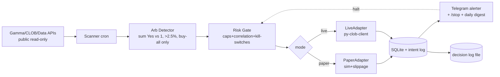

# Polymarket Arbitrage Bot — FINAL Consolidated Design

**Date:** 2026-06-24 · **Status:** FINAL (supersedes `design-260624-1050-polymarket-arb-dashboard.md` — **dashboard DEFERRED**) · **Verdict:** CAUTION (proceed with gates)

**Host:** Hermes Agent (cron + Telegram gateway). **Form:** a `personal/` automation, like `personal/tech-news-digest/`. **No web UI.**

---

## 1. Goal & Brutal-Honesty Reality

**Goal:** lowest-variance money on Polymarket via **multi-outcome arbitrage**; bounded **full-auto**; **monitoring via Telegram + logs** (no dashboard yet). Bankroll **$500 USDC.e** on Polygon.

**Must accept:**
1. Money needs real execution (CLOB + EIP-712 signing + capital). Read-only = $0.
2. Median arb spread ≈ **0.3%**; profitable threshold ≈ **2.5%** post-fee → actionable arbs **rare**.
3. **$500 = LEARNING budget, not income.** Realistic annualized **8–15%** (~$40–75/yr, optimistic). Reframe honestly: you pay ≤$500 + time to LEARN auto-trading/DeFi-signing/risk-eng.
4. Pro bots extract ~$40M arb; retail loses latency race on liquid markets → only illiquid/newly-opened multi-outcome events catchable.
5. **1 partial-fill bug = whole bankroll.** All-or-nothing is non-negotiable but **NOT atomic** over REST (probabilistic, not guaranteed).
6. **Paper ≠ profitability** (can't simulate slippage/partial-fill/latency/gas fully) → paper validates the **system**, not the **edge**.
7. Platform risk: smart contract, USDC.e depeg, **UMA void/dispute (refunds discretionary!)**, geo-block, fee changes (taker fees since 30 Mar 2026).

---

## 2. Strategy

- **Primary (MVP): multi-outcome buy-all arbitrage** — event has N outcomes; if SUM(best Yes) < $1.00 after fees/gas/slippage, **buy ALL legs** → near-riskless at resolution.
- **Equal-payout dutching:** `Stake_i = Total_Deploy × P_i / Σ(P)` (guard `P_i>0`).
- **DEFERRED / higher-risk (not MVP):**
  - **Short side (Σ>1)** — needs CTF mint/sell, operationally different → skip in MVP.
  - **Near-certain harvest (0.93–0.98)** — NOT arb (directional; resolve No = −93…98%) → separate sizing, tiny cap, only after MVP proven.
- **Avoid:** in-play sports, tiny illiquid markets (can't fill all legs), un-verifiable resolution, crypto 15-min (taker fees).

---

## 3. Capital Allocation ($500)

| Item | Limit | $ | Why |
|---|---|---|---|
| Reserve | 20% | **$100** | gas + opportunity + loss buffer — never dip below |
| Deployable | 80% | $400 | |
| Max / single arb | 15% | **$75** | partial-fill/void containment |
| Max open concurrent | 64% | **$320** | dry powder |
| Max / event cluster (correlation) | 16% | **$80** | shared resolution risk |
| Concurrent arbs | 2–3 | $60–80 each | uncorrelated |
| Min edge threshold | **>2.5%** post-fee | — | strictly greater |
| Kelly | **¼ Kelly** | — | survival > max return |
| Orders | maker (limit) only | — | avoid 0.75–1.8% taker fees |

---

## 4. Risk Controls / Kill-Switches (the ONLY brake — monitoring has no per-trade human gate)

| Trigger | Action |
|---|---|
| Daily loss ≤ **−$50** (10%) | halt 24h + Telegram |
| Drawdown ≤ **−$125** (25%) | halt + manual review |
| **ANY partial fill** | cancel-all + flatten immediately |
| Price stale >30s | skip |
| Gas >$0.05/tx | pause |
| Position reconcile mismatch | halt + alert |
| Heartbeat fail ×3 | halt + alert |
| Market disputed/void | halt category |
| Edge ≤2.5% / reserve <$100 / cap hit / same-event cluster full | skip |

Wallet isolated ($500 hot, main cold). Allowance 150%. Encrypted-env key (runtime=plaintext → **wallet cap is the real control**). `/stop` via Telegram + CLI. Daily reconcile 23:00 UTC.

---

## 5. Execution Safety — All-or-Nothing + Crash Recovery

**ExecutionAdapter** (bot agnostic): `PaperAdapter` (sim fills + **injected slippage/partial-fill probability from real book depth + latency**, no signing, SQLite virtual state) / `LiveAdapter` (`py-clob-client`, real sign). `mode: paper|live`.

**All-or-nothing sequence:**
1. pre-checks: staleness(<30s) + capital + **re-validate edge at submit (not scan)** + liquidity + fee-per-market(runtime) + caps + correlation
2. submit **limit (maker)** on ALL legs (60s expiry)
3. check EVERY leg FILLED
4. ANY unfilled → **cancel-all + flatten** (bounded loop; if flatten partial → halt + human alert)
5. reconcile actual vs expected → mismatch → flatten + halt
6. retry max 2× backoff; post-partial emergency → 5min cooldown + review

**Crash recovery (critical):**
- Write **intent before submit** (so crash leaves a record).
- **On boot: reconcile from exchange** — detect orphan orders/positions, flatten before any new trade.
- Idempotency key `(event, leg, price, cycle)` → no duplicate orders.

---

## 6. Monitoring & Control — NO Dashboard (Telegram + logs)

Dashboard **deferred** (YAGNI; add later only if bot proves profitable). Monitoring surface:
- **Real-time Telegram alerts:** partial-fill flatten, void/dispute, drawdown, reconcile fail, kill-switch fired.
- **Daily Telegram digest:** positions, realized/unrealized PnL, exposure vs caps, reserve floor, heartbeat.
- **`/stop` kill-switch** via Telegram + CLI (redundant; auto-halt-on-anomaly must NOT depend on Telegram).
- **Log file** (immutable decision trail: scan/detect/skip/exec/fill/cancel/flatten) for debug + audit/tax.

= exactly the `personal/tech-news-digest` pattern (cron Python script + GLM optional + Telegram send). Max DRY/KISS.

---

## 7. Architecture

---

## 8. Verdict: CAUTION (5-persona) — key recommendations folded in

Not GO (real money + non-atomic + bug-prone math). Not STOP (no blocker; all risks mitigated). **Proceed with gates.** Top recommendations:
1. **Phase 0.5 opportunity-sampler** (throwaway, 1–2 days) — measure multi-outcome spread distribution for ~1 week. **Cheapest gate** to kill the project if ≥2.5% arbs are too rare. *(Devil's Advocate + Performance)*
2. **1–2 manual arbs by hand** + **unit/property-test dutching math** before paper. *(Security + Devil's Advocate)*
3. Kill-switch tested cancel-in-flight; redundant (Telegram + CLI + auto). *(Security + UX)*
4. Honest reframe: learning exercise, capped downside. *(Devil's Advocate)*
5. Verify before plan: (a) Hermes plugin system for any extension? (b) Polymarket native all-or-nothing order, or simulate via limits? *(Architect)*

---

## 9. Critical Edge-Case Gates (from 48-scenario analysis → acceptance tests)

- **Reconcile-from-exchange on boot** (#15/20/31/32): orphan order/position detection + flatten before new trades.
- **Intent-before-submit + idempotency** (#11/24/30): crash leaves record; no duplicate orders.
- **Edge re-validation at submit** (#6): scanned edge may be gone; limit price won't fill if moved against.
- **CLOB-down-after-submit** (#22): if can't query/cancel → halt + human alert (don't auto-fix unhedged).
- **Math guards** (#3): `P_i>0`, skip NaN; **MVP buy-all only** (#45, defer short-side); **harvest separated from arb sizing** (#47).
- **Fee fetched per-market at runtime** (#33): don't hardcode (fee schedule changed 30 Mar 2026).
- **Reserve/concurrency re-checked at submit** (#42/43/44), not just scan.

(Full 48 scenarios available on request → feed to `ck:test`.)

---

## 10. Phasing

| Phase | What | Money | Gate to next |
|---|---|---|---|
| **0. Setup** | wallet+signing, allowance, L2 key; scanner scaffold; SQLite+intent-log; Telegram alerter + `/stop` | none | boots, alerts reach TG |
| **0.5 Sampler** *(throwaway)* | measure spread distribution of multi-outcome events ~1 wk | none | **enough Σ<1 gaps ≥2.5% to justify building** |
| **1. Paper (2–4 wk)** | full-auto in PAPER via PaperAdapter; watch edge-case handling (partial fill, stale, void); + 1–2 manual arbs for execution feel | ❌ virtual | all-or-nothing/kill-switches proven in sim **AND** edge looks real |
| **2. Live bounded auto** | flip LiveAdapter; caps + kill-switches + `/stop` live; start tiny, observe | ✅ $500 | — |

No per-trade human-confirm (full-auto). Human = standby with kill-switch.

---

## 11. Stop Conditions (decision gates — honor them or lose money for nothing)

- Phase 0.5 sampler shows ~0 gaps ≥2.5% → **stop, don't build bot.**
- Phase 1 paper can't reliably cancel+flatten simulated partial fills → **don't go live.**
- Live hits drawdown −$125 twice → **pause, review, fix before resume.**

---

## 12. Security

- Key backend-only, isolated $500 wallet, never logged, never in frontend (no frontend now anyway).
- Bot is a cron script — bind nothing public; no web auth surface (dashboard deferred).
- Telegram bot token = kill-only command scope; rotate on suspicion.
- Audit log immutable (reconstruct trades for dispute/tax).

---

## 13. Success Criteria

- **Paper:** all-or-nothing cancels+flattens injected partial fills; kill-switches fire on injected loss/drawdown; scanner detects known historical arbs; sampler shows enough opportunity.
- **Live:** 0 unhedged exposures; reconcile matches exchange every cycle; caps respected; `/stop` <5s; net PnL tracked vs paper baseline.

---

## 14. Unresolved Questions (verify in plan phase)

1. Polymarket native all-or-nothing order type, or simulate via limits?
2. py-clob-client v2 vs v0.24 for our signing/proxy flow?
3. Realistic partial-fill probability source for paper sim (orderbook depth proxy)?
4. UMA void/refund policy specifics (discretionary?).
5. Exact CLOB rate limits (multi-leg burst)?
6. Hermes plugin system — relevant if we later want first-party integration (not now).

---

## 15. References (sources of truth)

- Capital research: `plans/reports/researcher-260624-1123-polymarket-bankroll-sizing.md`
- Risk-controls research: `plans/reports/researcher-260624-1050-polymarket-risk-controls.md`
- Earlier dashboard-centric design (superseded): `plans/reports/design-260624-1050-polymarket-arb-dashboard.md`
- Read-only Polymarket skill (reuse API wrappers): `skills/research/polymarket/`
- Personal automation pattern (cron + Telegram): `personal/tech-news-digest/`
- py-clob-client: https://github.com/Polymarket/py-clob-client · Auth: https://docs.polymarket.com/api-reference/authentication
