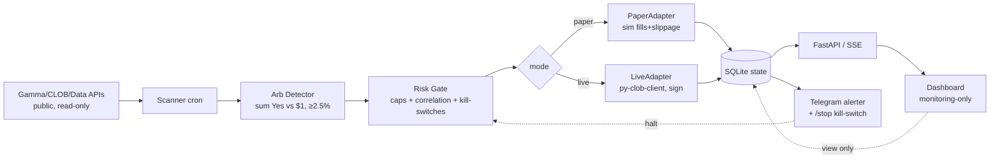

# Polymarket Arbitrage Bot + Monitoring Dashboard — Design

**Date:** 2026-06-24 | **Bankroll:** $500 USDC.e (Polygon) | **Autonomy:** bounded full-auto | **Dashboard:** standalone, monitoring-only

---

## 1. Problem & Goal

Make money on Polymarket with the **lowest variance** (accept small P/L), using Hermes Agent as the host. User wants a **dashboard to manage/monitor** and to **paper-trade before going live**.

End state: a standalone personal bot that **auto-trades multi-outcome arbitrage** under hard caps + kill-switches, with a **monitoring-only dashboard** (no order entry from UI). Human intervenes only via emergency kill-switch.

---

## 2. Brutal-Honesty Reality (MUST accept before building)

1. **Money requires real execution** — read-only yields $0. Need CLOB API + EIP-712 signing + capital.
2. **Median arb spread ≈ 0.3%**, profitable threshold ≈ **2.5%** post fees/gas/slippage → actionable arbs are **rare** ("fishing for outliers").
3. **$500 = LEARNING budget, not income.** Realistic annualized **8–15%** after capital lockup (~$40–75/yr, optimistic).
4. **Competition:** pro bots already extract ~$40M arb; retail loses latency race on liquid markets → only catch arbs on less-liquid / newly-opened multi-outcome events.
5. **1 partial-fill bug = whole bankroll gone** → all-or-nothing execution is non-negotiable.
6. **Paper ≠ profitability.** Paper can't simulate execution reality (slippage, partial fills, latency, gas, reverts) → paper PnL is optimistic. Paper validates the **system**, not the **edge**.
7. **First ~10 live arbs may lose** to execution mistakes.
8. **Platform risk:** smart contract, USDC.e depeg, **UMA void/dispute (refunds discretionary!)**, geo-block, fee changes (taker fees since 30 Mar 2026).

**Decision gate:** if Phase-1 paper shows ~0 arbs ≥2.5% over 2–4 weeks → **stop, do not go live.** Cheapest possible de-risk.

---

## 3. Strategy

- **Primary: multi-outcome arbitrage.** Event with N mutually-exclusive outcomes; if SUM(best Yes prices) < $1.00 (after fees/gas/slippage), buy all legs → near-riskless profit at resolution. If > $1.00, short all.
- **Secondary: near-certain resolution harvest** — buy markets priced 0.93–0.98 whose outcome is effectively known → resolve $1.00.
- **Avoid:** in-play sports (too fast), tiny illiquid markets (can't fill all legs), markets you can't verify resolution of, crypto 15-min markets (taker fees eat margin).

**Equal-payout dutching (per-leg stake):** `Stake_i = Total_Deploy × P_i / Σ(P)` → identical profit regardless of winner.

---

## 4. Capital Allocation ($500)

| Item | Limit | $ | Why |
|---|---|---|---|
| Reserve | 20% | **$100** | gas + opportunity + loss buffer — never dip below |
| Deployable | 80% | $400 | |
| Max / single arb | 15% bankroll | **$75** | partial-fill/void containment |
| Max open concurrent | 64% | **$320** | keep dry powder |
| Max / event cluster (correlation) | 16% | **$80** | shared resolution risk |
| Concurrent arbs | 2–3 | $60–80 each | uncorrelated only |
| Min edge threshold | **2.5%** post-fee | — | below = skip |
| Kelly | **¼ Kelly** | — | survival > max return |
| Target/arb | 1.25–2% | $1.50–2.50 | after friction |
| Maker orders only | — | — | avoid 0.75–1.8% taker fees |

---

## 5. Risk Controls / Kill-Switches (automated — the ONLY brake in monitoring-only model)

| Trigger | Action |
|---|---|
| Daily loss ≤ **−$50** (10%) | halt 24h + Telegram |
| Drawdown ≤ **−$125** (25%) | halt + manual review |
| **ANY partial fill** | cancel-all + flatten immediately |
| Price stale >30s | skip opportunity |
| Gas >$0.05/tx | pause all |
| Position mismatch (reconcile) | halt + alert |
| Heartbeat fail ×3 | halt + alert |
| Market disputed/void detected | halt category |
| Edge <2.5% / reserve <$100 / caps hit | skip trade |

**Wallet separation:** trading wallet holds ONLY $500 (hot), main funds cold. Token allowance 150%. Key in encrypted env, never logged. Kill-switch `/stop` via Telegram + CLI. Daily reconcile 23:00 UTC.

---

## 6. Execution Safety — All-or-Nothing + Adapter

**ExecutionAdapter interface** (bot/dashboard agnostic):
- `PaperAdapter` — simulates fills vs snapshot orderbook, **injects slippage + partial-fill probability from real book depth + latency** (so paper isn't falsely optimistic). No signing. Virtual balance/positions in SQLite.
- `LiveAdapter` — wraps `py-clob-client` (L1 key + L2 API key; proxy or EOA; token allowances). Real signing.

Switch via `mode: paper|live`. Dashboard shows distinct PnL (color) + "DEMO" watermark in paper.

**All-or-nothing sequence (non-negotiable):**
1. price-staleness + capital + edge + liquidity pre-checks → fail = skip
2. submit **limit (maker)** orders on **ALL legs** (60s expiry)
3. wait → check **every** leg FILLED
4. **if ANY unfilled → cancel-all + flatten filled legs immediately** (accept slippage)
5. reconcile actual vs expected holdings → mismatch → flatten + halt
6. all filled + verified → success
7. retry: max 2× backoff; after any partial-fill emergency → 5min cooldown + review

---

## 7. Dashboard Design (standalone in `personal/polymarket-bot/`, monitoring-only)

**Decision:** standalone, NOT first-party — Hermes is upstream product you `hermes update`; don't couple real-money signing code into core. Reuse Hermes **patterns** (FastAPI + shadcn-style + dark theme) by copying conventions, not files. (Check Hermes plugin system in plan phase — if it supports dashboard extensions, that's the ideal no-fork path.)

**Stack:** FastAPI backend (reads bot state from SQLite, pushes via SSE/WebSocket) + lean React/Vite single-page status board (shadcn-style components). Localhost-bound + own auth for live mode.

**MVP monitoring views (KISS — no order entry):**
1. **Mode banner** PAPER/LIVE + kill-switch status (big, always visible)
2. **Bankroll & exposure** — reserve/deployed/open vs caps, free capital, reserve floor alert
3. **Open positions** — legs, event, entry, current price, unrealized PnL, est. resolve date
4. **Arb feed / trade log** — detected arbs, executed/skipped (reason), fills, all-or-nothing events
5. **PnL** — realized/unrealized, daily, drawdown vs limits
6. **Risk panel** — daily loss vs −$50, drawdown vs −$125, kill-switches fired, heartbeat, gas
7. **Alerts stream** — partial-fill flatten, void detected, gas spike, stale price, reconcile fail

**Architecture:**

---

## 8. Phasing

| Phase | What | Money | Gate to next |
|---|---|---|---|
| **0. Setup** | wallet+signing, allowance, L2 key; dashboard scaffold + PaperAdapter + scanner; SQLite state | none (no trade) | dashboard renders in PAPER |
| **1. Paper (2–4 wk)** | bot full-auto in PAPER; dashboard monitors sim trades; watch edge-case handling (partial fill, stale, void) | ❌ virtual | **≥2.5% arbs appear often enough** AND all-or-nothing/kill-switches proven |
| **2. Live bounded auto** | flip LiveAdapter; caps + kill-switches + Telegram stop live; start tiny, observe | ✅ real $500 | — |

No per-trade human-confirm phase (monitoring-only). Human = standby with kill-switch.

---

## 9. Security

- Private key **backend only** (LiveAdapter), never frontend.
- Dashboard = view-only; no order placement from UI (per user decision).
- Reuse Hermes auth patterns; standalone adds own auth + localhost bind for live.
- Trading wallet isolated ($500 cap). Encrypted env key, never logged.
- Loud real-time alerting (partial-fill, void, drawdown) → because dashboard can't brake, alerts must be.

---

## 10. Success Criteria / Validation

- **Paper:** all-or-nothing correctly cancels+flattens on simulated partial fill (test injected). Kill-switches fire on injected daily-loss/drawdown. Scanner detects known historical arbs. ≥N arbs ≥2.5% over window.
- **Live:** 0 unhedged exposures; reconcile matches exchange state every cycle; daily-loss/drawdown caps respected; Telegram kill-switch <5s latency; net PnL tracked vs paper baseline.

---

## 11. Risks & Mitigations

| Risk | Severity | Mitigation |
|---|---|---|
| Partial fill → unhedged | **Critical** | all-or-nothing cancel+flatten; paper-tested |
| Sign/allowance bug loses funds | High | isolated $500 wallet; paper→live gate; reconcile |
| Edge overestimated (slippage) | High | injected-slippage paper sim; 2.5% floor; maker orders |
| Void/dispute (refunds discretionary) | Med | avoid high-dispute markets; diversify ≤5–10 open; cap/cluster $80 |
| Capital lockup / illiquidity | Med | target <7d resolve; track pending-resolution |
| Geo-block / fee change | Med | verify jurisdiction; maker orders; fee-check per trade |
| Key compromise | High | encrypted env; hot wallet cap; no logs |
| Opportunity too rare to justify | — | Phase-1 paper gate stops project cheaply |

---

## 12. Unresolved Questions

1. Does Hermes plugin system support loading dashboard extensions (no-fork path)?
2. Polymarket native all-or-nothing order type, or must simulate via limits? (affects execution design)
3. Actual slippage / partial-fill distribution on Polymarket multi-leg (calibrate paper sim → needs live/paper data).
4. UMA void/refund policy specifics (discretionary?).
5. Exact CLOB rate limits (multi-leg burst).
6. Does py-clob-client v2 vs v0.24 matter for our signing flow?
7. Paper sim: how to source realistic partial-fill probability (orderbook depth proxy)?

---

## 13. References

- Capital allocation research: `plans/reports/researcher-260624-1123-polymarket-bankroll-sizing.md`
- Risk controls research: `plans/reports/researcher-260624-1050-polymarket-risk-controls.md`
- Existing Hermes dashboard infra: `web/` (React+Vite), `hermes_cli/web_server.py` (FastAPI, port 9119, auth), `apps/desktop/`, `tui_gateway/` (WS)
- Existing read-only Polymarket skill: `skills/research/polymarket/` (Gamma/CLOB/Data APIs)
- Personal automation pattern: `personal/tech-news-digest/`
- py-clob-client: https://github.com/Polymarket/py-clob-client · Auth: https://docs.polymarket.com/api-reference/authentication
